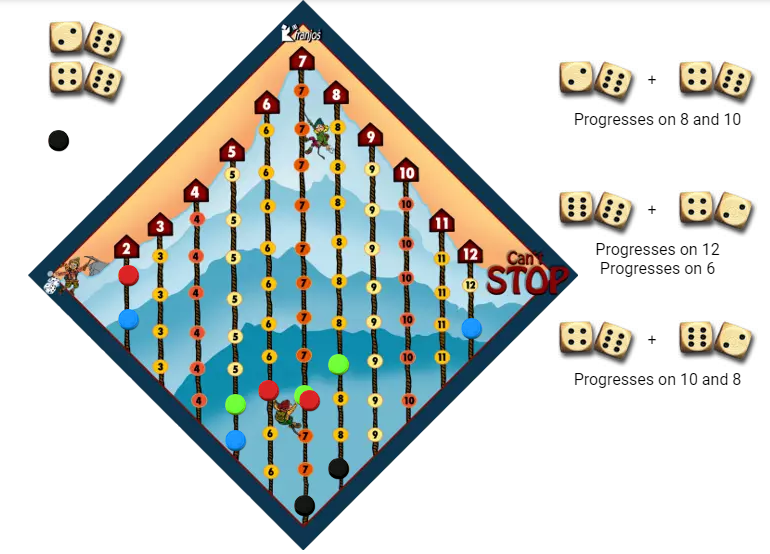

---
jupyter:
  jupytext:
    formats: ipynb,md
    text_representation:
      extension: .md
      format_name: markdown
      format_version: '1.2'
      jupytext_version: 1.6.0
  kernelspec:
    display_name: Python 3
    language: python
    name: python3
---

# Introduction


"Can't stop!" is a board game played with two to three players who roll four dice during their turn.  The aim is to get mounteneers to the top.  The first player to get three mounteneers to the top wins the game.

The dice must be combined in pairs, so suppose a player rolls $(3, 5, 4, 2)$ the following combinations can be made:

* $(3, 5) = 8, (4, 2) = 6$
* $(3, 4) = 7, (5, 2) = 7$
* $(3, 2) = 5, (5, 4) = 9$

What is the probability that a player rolls such that she has, e.g., 7 and 9?  Compute the probabilities for all outcomes.





# Requirements

```python
from collections import Counter
from itertools import product
import matplotlib.pyplot as plt
%matplotlib inline
```

# Implementation


We need a function to create all the possible pairs for a specific throw of the dice.  For instance, for the throw $(1, 2, 3, 4)$ the pairs $((1, 2), (3, 4))$, $((1, 3), (2, 4))$ and $((1, 4), (2, 3))$.

```python
def pair_up(dice):
    pairs = list()
    for i in range(1, 4):
        pair1 = (dice[0], dice[i])
        pair2 = tuple(dice[j] for j in range(1, 4) if j != i)
        pairs.append((pair1, pair2))
    return pairs
```

```python
pair_up((1, 2, 3, 4))
```

We can now count the number of times a certain pair comes up, and how many times a pair of pairs is thrown.

```python
single_counter = Counter()
pair_counter = Counter()
for dice in product(range(1, 7), repeat=4):
    for pair1, pair2 in pair_up(dice):
        index = tuple(sorted((sum(pair1), sum(pair2))))
        single_counter[index[0]] += 1
        single_counter[index[1]] += 1
        pair_counter[index] += 1
```

## Single throw probabilties

```python
single_probabilities = {eyes: count/sum(single_counter.values()) for eyes, count in single_counter.items()}
```

```python
len(single_probabilities)
```

```python
for throw, prob in single_probabilities.items():
    print(f'{str(throw):10s}: {prob:.5f}')
```

```python
_ = plt.figure(figsize=(15, 10))
_ = plt.bar(x=single_probabilities.keys(), height=single_probabilities.values())
```

## Pair throw probabilties

```python
pair_probabilities = {pair: count/sum(pair_counter.values()) for pair, count in pair_counter.items()}
```

```python
len(pair_probabilities)
```

```python
for throw, prob in pair_probabilities.items():
    print(f'{str(throw):10s}: {prob:.5f}')
```

```python
_ = plt.figure(figsize=(20, 10))
_ = plt.bar(x=range(len(pair_probabilities)), height=pair_probabilities.values())
_ = plt.xticks(range(len(pair_probabilities)), map(str, pair_probabilities.keys()), rotation='vertical')
```

It would be useful to visualize the probabilities in descending order.

```python
sorted_pair_probabilities = sorted(((pairs, prob) for pairs, prob in pair_probabilities.items()), key=lambda x: -x[1], )
```

```python
_ = plt.figure(figsize=(20, 10))
_ = plt.bar(x=range(len(sorted_pair_probabilities)), height=list(x[1] for x in sorted_pair_probabilities))
_ = plt.xticks(range(len(sorted_pair_probabilities)), map(str, (x[0] for x in sorted_pair_probabilities)), rotation='vertical')
```
